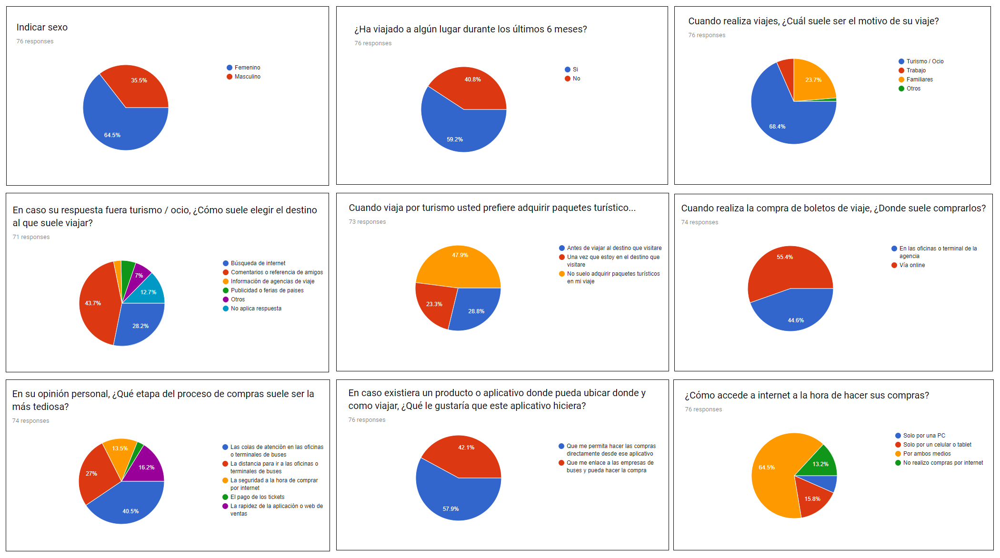
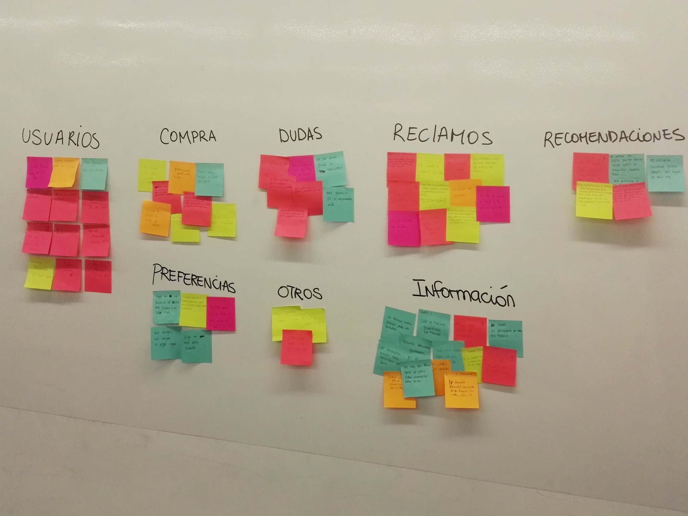
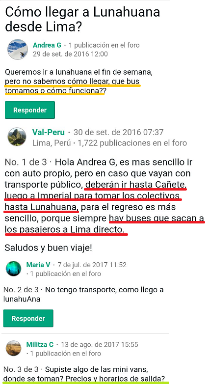
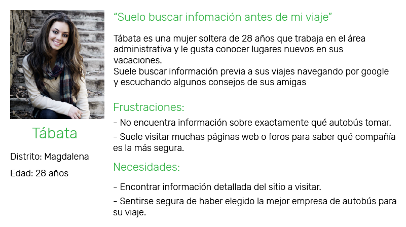
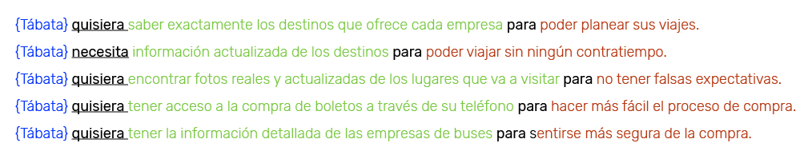
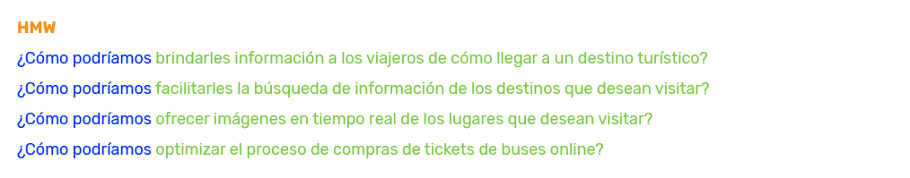
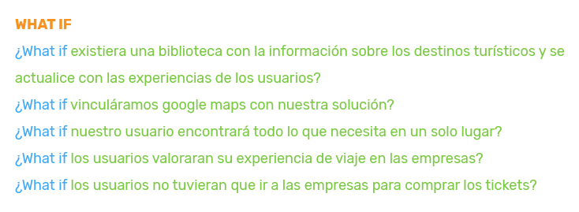
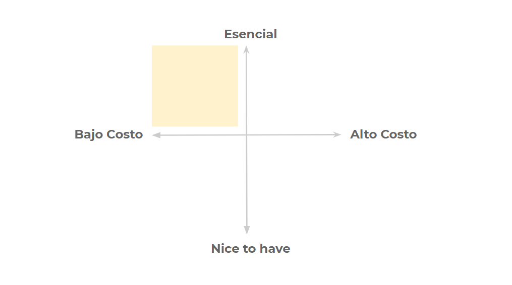
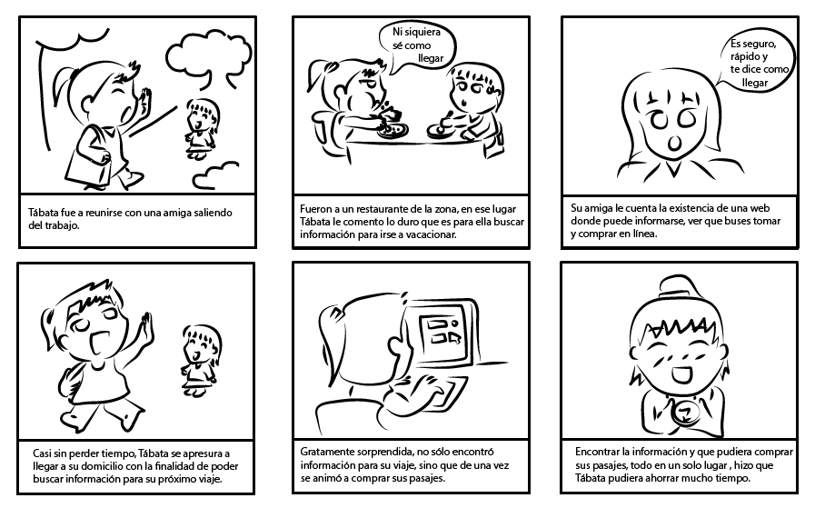

### NUEVA EXPERIENCIA EN EMPRESAS DE BUSES

#### Nuestro proceso de diseño

## DESCUBRIMIENTO E INVESTIGACIÓN

### Planeamiento

Presentación de Kick Off y conversaciones en el Squad para poder analizar cuáles serían las metodologías a usar para el reto asignado.

### User Research

##### Día 1: RESEARCH CUALITATIVO

Se realizó un **diagrama de Afinidad** con la finalidad de poder analizar las propuestas de preguntas de cada una y no repetirlas durante la entrevista.

El squad se dividió en dos equipos:

###### Equipo A: Terminal Terrestre Plaza Norte

###### Equipo B: Terminal Terreste Cruz del Sur y Movil Tours

Se realizó una **observación contextual** dentro del terminales de autobuses para conocer como era el comportamiento de los usuarios, se descubrió lo siguiente:

- Los usuarios se sentían fastidiados por la larga cola en la compra.

- Los usuarios que esperaban abordar miraban aburridos en todas las direcciones o caso contrario sus celulares.

- Algunos usuarios parecían nerviosos y estaban muy atentos para tener cuidado en no dejar pasar su autobus.

Posteriormente, el equipo comenzó a realizar las **entrevistas** a personas estaban haciendo fila para la compra de pasajes o esperaban abordar.

###### Es importante mencionar que en el proceso se obtuvo muchos bloqueantes por parte de la seguridad de los terminales, quienes indicaban que se tenía que pedir permiso a la administración como mínimo de un día antes por lo que en muchos casos interrumpieron abruptamente la entrevista con los usuarios. Sin embargo, aún así el equipo se las ingenio para seguir realizando las entrevistas de una manera más discreta.

Al promediar las 16:00 horas, el equipo se junto en el domicilio de la integrante Stephanie Wong con la finalidad de compartir sus experiencias durante el trabajo de campo, darse feedbacks sobre lo que se hizo bien, pudo haber sido mejor y como cada una hubiera abordado la situación.

Ya con los datos comparados, el equipo procede a contactarse con otros usuarios más cercanos, con la finalidad de tener un espacio más cómodo para una segunda entrevista.

*PENDIENTE ADJUNTAR + FOTOS*

##### Día 2: RESEARCH CUANTITATIVO

Se realiza las **encuestas** que serán enviadas a familiares y amigos a través de internet, con la finalidad de darnos una idea de la situación actual.

Para esta fase del proceso se usaron las siguientes herramientas:

- Google form

## SINTESIS Y DEFINICIÓN

### SINTESIS

#### 1.- Affinity Mapping

Durante las horas de clases, y con la orientación de nuestros profesores Gonzalo Loayza y Gabriela Segura, se comenzó a trabajar para realizar el ejercicio de **findings en post it** para posteriormente realizar el **Affinity Mapping** donde se agruparon los problemas según su categoría.

Se agruparon todas las observaciones de los usuarios en las siguientes categorías :

- Compras
- Dudas
- Información
- Preferencias
- Reclamos
- Recomendaciones
- otros

Luego de analizar todo la información obtenida, nos dimos cuenta de que de las categorías **Información** y **Reclamos** tienen más coincidencia entre nuestros usuarios, por ellos decidimos abordar estas categorías para la obtención de nuestra problemática.

#### Problemática sobre la información

- "He buscado en muchas páginas de internet, pero no encuentro información sobre qué buses debo tomar..."
- "No encuentro información actualizada"
- "Pierdo mucho tiempo buscando información de los lugares"
- "Pido recomendaciones a mis amigos y familiares sobre buses y lugar a los que voy"
- "Realizo mis búsquedas en foros"

Estos son algunos comentarios que hicieron los usuarios en las entrevistas.

También encontramos esta problemática en algunos foro de internet

##### Día 3 : 

#### 2.- User Persona

Con la información recaudada de las entrevistas, se define nuestro User Persona. 

#### 3.- Problem Statement

Usamos el siguiente patrón para definir un problema:

#### 4.- How Might We? (HMW)

#### 5.- What if? (HMW)

##### Día 4 : Conceptualización

### 1. Feature List

#### Benchmark: 
Sabemos que el principal problema de nuestro usuario es la información ¿Cómo lo resolvieron otras empresas?

#### Análisis Competitivo

Identificamos a nuestros competidores y evaluamos sus estrategias para determinar sus fortalezas y debilidades en relación con las de nuestra propia solución.

Para esto utilizamos la técnica **Thinking Aloud Testing**

Definición : En una prueba de pensamiento en voz alta, se pide a los participantes que usen el sistema mientras que continuamente piensan en voz alta, es decir, simplemente verbalizan sus pensamientos a medida que se mueven a través de la interfaz de usuario.

- Nuestra participante realizó la prueba en la interfaz de la aplicación Red Bus:

Video: [video1](https://drive.google.com/file/d/1c1ewF5pY5lNjwVpea0DtB4yeh0WMUImb/view)

#### Priorización

Luego de observar la información recogida y analizados nuestros Problem Statements, se prioriza lo descubierto (**falta de información**)

#### MVP

Nuestro producto mínimo viable debe contener lo siguiente: 

#### Storyboard

#### Content Prototype

### **Integrantes**

>##### Esthefany Humpiri Vargas
>##### Flora María Huerta
>##### Lourdes lissete Loayza mesias
>##### Mayte Infante Vivas
>##### Paola Silvana Huaman Luyo
>##### Stephanie Wong Vega

"La última y mejor experiencia que alguien tiene en cualquier lugar se convierte en la expectativa mínima de las experiencias que desean en todas partes."
