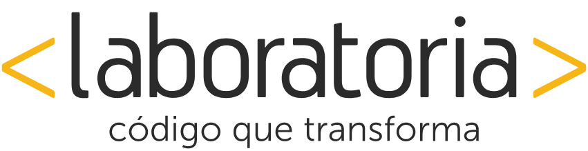
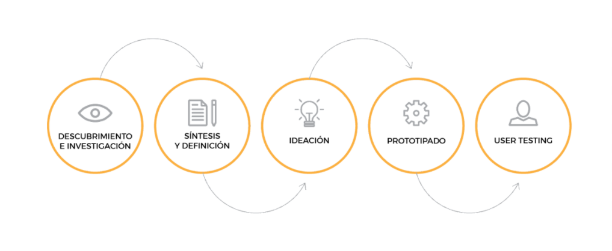
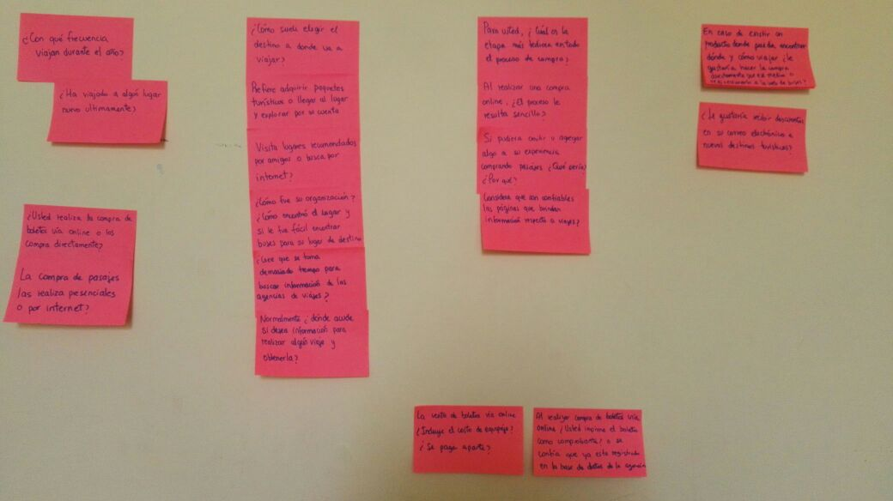
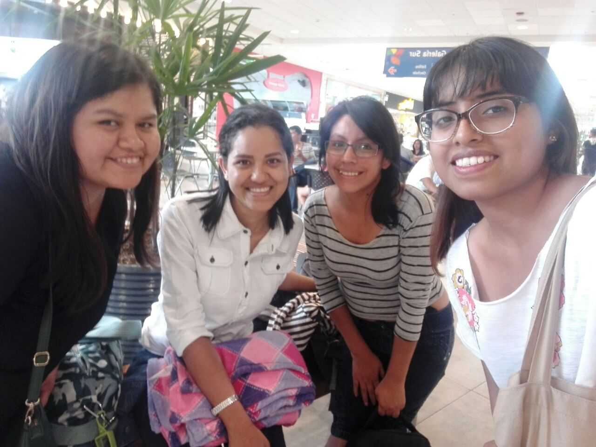
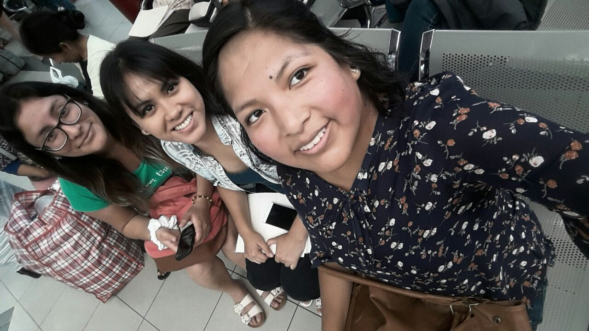
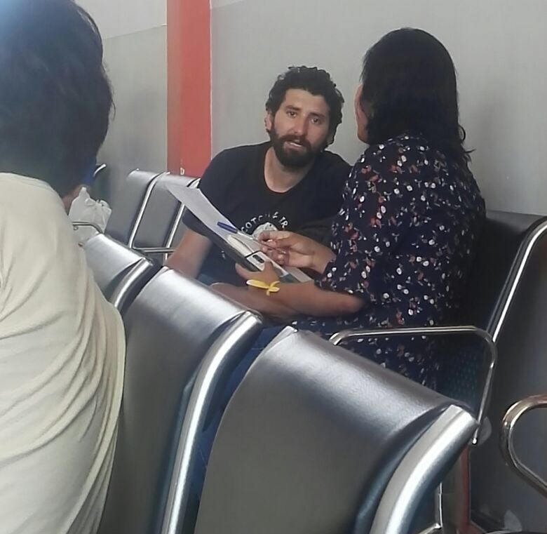

### NUEVA EXPERIENCIA EN EMPRESAS DE BUSES

#### Nuestro proceso de diseño

## DESCUBRIMIENTO E INVESTIGACIÓN

### Planeamiento

Presentación de Kick Off y conversaciones en el Squad para poder analizar cuáles serían las metodologías a usar para el reto asignado.

### User Research

##### Día 1: RESEARCH CUALITATIVO

Se realizó un **diagrama de Afinidad** con la finalidad de poder analizar las propuestas de preguntas de cada una y no repetirlas durante la entrevista.

El squad se dividió en dos equipos:

###### Equipo A: Terminal Terrestre Plaza Norte

        
###### Equipo B: Terminal Terreste Cruz del Sur y Movil Tours

Se realizó una **observación contextual** dentro del terminales de autobuses para conocer como era el comportamiento de los usuarios, se descubrió lo siguiente:

- Los usuarios se sentían fastidiados por la larga cola en la compra.

- Los usuarios que esperaban abordar miraban aburridos en todas las direcciones o caso contrario sus celulares.

- Algunos usuarios parecían nerviosos y estaban muy atentos para tener cuidado en no dejar pasar su autobus.

Posteriormente, el equipo comenzó a realizar las **entrevistas** a personas estaban haciendo fila para la compra de pasajes o esperaban abordar.

###### Es importante mencionar que en el proceso se obtuvo muchos bloqueantes por parte de la seguridad de los terminales, quienes indicaban que se tenía que pedir permiso a la administración como mínimo de un día antes por lo que en muchos casos interrumpieron abruptamente la entrevista con los usuarios. Sin embargo, aún así el equipo se las ingenio para seguir realizando las entrevistas de una manera más discreta.

Al promediar las 16:00 horas, el equipo se junto en el domicilio de la integrante Stephanie Wong con la finalidad de compartir sus experiencias durante el trabajo de campo, darse feedbacks sobre lo que se hizo bien, pudo haber sido mejor y como cada una hubiera abordado la situación.

Ya con los datos comparados, el equipo procede a contactarse con otros usuarios más cercano con la finalidad de tener un espacio más cómodo para una segunda entrevista.

*PENDIENTE ADJUNTAR + FOTOS*

##### Día 2: RESEARCH CUANTITATIVO

Se realiza las **encuestas** que serán enviadas a familiares y amigos a través de internet, con la finalidad de darnos una idea de la situación actual.

Para esta fase del proceso se usaron las siguientes herramientas:

- Survey Monkey

### **Integrantes**

>##### Esthefany Humpiri Vargas
>##### Flora María Huerta
>##### Lourdes lissete Loayza mesias
>##### Mayte Infante Vivas
>##### Paola Silvana Huaman Luyo
>##### Stephanie Wong Vega

"La última y mejor experiencia que alguien tiene en cualquier lugar se convierte en la expectativa mínima de las experiencias que desean en todas partes."

